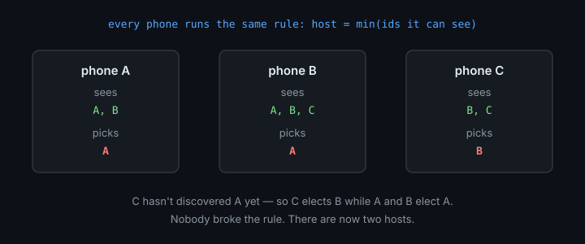
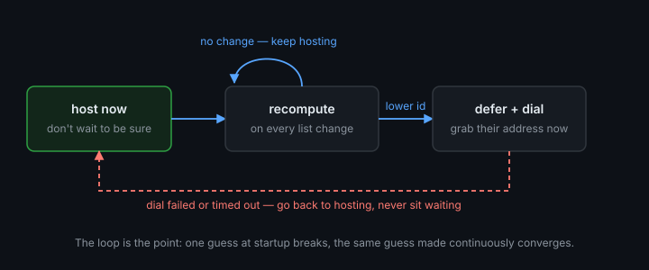

# Picking a host

You have a few phones in a room, each showing the others in a list. Someone has to
be the host. Who?

## The short answer: connect first, then decide

Don't pick a host from the list. Connect the phones together first, then let kuilt
pick — with `electLobby`:

```kotlin
val lobby = roomFactory.electLobby(Pattern("table-7"))
// lobby.host is a live value every phone agrees on.
if (lobby.host.value == lobby.selfId) lobby.start() else lobby.awaitRoom()
```

Every phone runs the same rule over the same set of *connected* peers, so they all
reach the same answer with nothing to negotiate. This is the path to use. If your
transport can connect the phones to each other, take it and stop reading.

## What if the host walks out?

Someone puts their phone in their pocket and leaves before the game starts. The
phone with the next-lowest id is now the host — and it needs to know that, because
it was waiting to be told the game had begun.

`awaitRoom()` tells it. The call ends one of three ways, and only one of them is
the game starting:

| It ends with | What happened | What to do |
|---|---|---|
| `Adopted(room)` | The host started the session. | Play. |
| `BecameHost` | The host left. **You** are the host now. | Call `start()` on the **same** lobby. |
| `Torn(reason)` | The connection collapsed — everyone else left, or the link itself dropped. | Go back to `electLobby(...)`. |

The important one is the middle row, and the important word in it is **same**.
The other phones are still waiting on the connection you already have, so
`start()` on that lobby reaches them instantly. Starting over with a fresh
`electLobby(...)` builds a *new* connection they are not on — you would sit
alone in an empty lobby while they wait for a host that never speaks.

<tip>
Don't infer "I was promoted" from <code>host.value == selfId</code> yourself.
While the phones are still finding each other, whoever has the lowest id
<em>so far</em> sees exactly that — and a lower phone is about to appear.
<code>awaitRoom()</code> knows the difference; a bare comparison doesn't.
</tip>

## Why not just pick from the list?

Because the list isn't the same on every phone, and the phones can't tell.



Phone A sees B. Phone C hasn't spotted A yet. Each picks the lowest id it knows —
and they pick different hosts. Everyone followed the rule; everyone disagrees.
There are three separate ways this happens:

- **One phone hasn't seen another yet.** Discovery takes seconds, and the phone
  with the lowest id always sees *itself* immediately — so it elects itself while
  others elect someone else.
- **Departed phones linger.** Some discovery sources only ever *add*; a phone that
  walked out is still in the list. Pick it and you dial something that isn't there.
- **The same phone has two names.** Discovered over Bonjour it has one identifier,
  over Multipeer another. Merge two sources into one list and "lowest id" isn't
  even a well-defined question — two phones with a *perfect* view still disagree.

Connecting first makes all three go away, which is why `electLobby` is the answer
whenever it's available.

## If you truly can't connect first

Some transports need to know who hosts before anyone can connect. Then you can't
have agreement — so don't pretend to. Treat your pick as a **guess you keep
revising**:



1. **Start hosting immediately.** Don't wait to be sure.
2. **Keep watching.** Every time the list changes, recompute the lowest id.
3. **Defer if someone lower appears.** Stop hosting, dial them instead — grabbing
   their address at the moment you decide, before it can vanish.
4. **If dialling fails, go back to hosting.** Never leave the phone stuck waiting.

The loop is the point. A single guess at startup is the thing that breaks; the
same guess, made continuously, converges.

<warning>
Three ways to get this wrong:

- **Deciding once.** The rule must re-run on every change, forever.
- **Trusting a list that never shrinks.** Check your discovery source removes
  departed peers; some don't.
- **Expecting kuilt to break a tie between two phones dialling each other.**
  That's the transport's job, and only after a connection exists — there is
  nothing kuilt can do before one does.
</warning>

The design rationale, and why kuilt ships no primitive for this, is in
[`docs/discovery-bootstrap.md`](https://github.com/tractat-us/kuilt/blob/main/docs/discovery-bootstrap.md).
