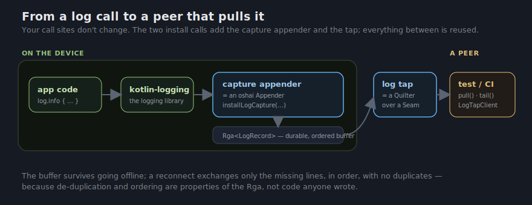

# Reaching into a device for its logs

> The story of how kuilt captures an app's logs on the device and lets you pull
> them out — from an iOS simulator, a CI job, or a real phone in someone's hand.
> Read it top to bottom: it starts with the problem anyone can feel and walks
> down into the machinery only as far as you want to go.

## The one idea

Your app is misbehaving on an iPhone. Not your iPhone — a tester's, three time
zones away. The logs that would tell you *why* are right there, scrolling past
inside the running app… and you cannot get to them. There is no file to open, no
terminal to `tail`, no cable long enough. You ask the tester to "reproduce it
with Console.app open and send a screen recording," and you both lose an
afternoon.

What if, instead, a test on your laptop could just **connect to the running app
and pull its logs out** — every line, in order, exactly as the app wrote them?

```kotlin
// On the device — the app keeps logging the way it always has:
private val log = KotlinLogging.logger {}
log.info { "joined room ${room.id}" }

// In a test or CI job — reach in and take the logs:
val logs = LogTapClient(seam).pull()        // every line the device buffered, in order
assertTrue(logs.any { it.body == "joined room lobby-7" })
```

That's the whole idea. Two calls — one that captures, one that pulls — and the
logs come off the device. Everything below is the story of why those two calls
are *all you should have to write*, and the one place a platform makes you write
a little more.

## Why this isn't hard to build: it's mostly already here

The reason this is two calls and not a project is that "pull the logs off a
device" needs four things, and kuilt already ships all four. The work was never
"build a log pipeline." It is **"notice we already have one, and give it two
ends."**

| Pulling logs off a device needs… | …and kuilt already has |
|---|---|
| somewhere safe to keep logs while the device is offline | a durable, crash-safe on-device store (`:kuilt-otel`) |
| logs stored so a resend can't duplicate or reorder them | the log buffer **is** an [`Rga<LogRecord>`](https://tractat-us.github.io/kuilt/guide/crdt-rga.html) — an ordered, append-only CRDT |
| a way to move that buffer to another machine | live replication over any connection (`Quilter` over a `Seam`) |
| connections that reach a sim, a LAN phone, or a far server | every fabric kuilt ships (loopback, mDNS, Multipeer, WebRTC, WebSocket) |


So the feature is a *thin reframing*, not a new engine. Each piece is a small
wrapper over something kuilt already has — and the doc will keep doing this on
purpose: **name the logging role, then reveal the primitive under it.**

- A **capture appender** *is* an oshai `Appender` that writes each log line into the buffer.
- The **on-device log buffer** *is* an `Rga<LogRecord>` — the append-only sequence CRDT.
- The **log tap** *is* a `Quilter` replicating that `Rga` over a `Seam`.
- The **transport** *is* whichever fabric reaches the device — nothing logging-specific about it.

The capture layer is *vocabulary*, not machinery — which is exactly why the only
new code is the two install calls.

## The reduction: two ends on a buffer that already exists

Standard log-extraction stacks are a pile of moving parts: a logging backend, an
on-device agent, a wire protocol, a collector to receive it, plus the unglamorous
work of de-duplicating retries and keeping everything in order. Watch the pile
collapse.

### End one — capture: your existing logs, no call-site changes

```kotlin
installLogCapture(exporter, CaptureConfig(minLevel = Level.INFO), clock, random, scope)
```

One call, identical on JVM, Android, iOS, macOS, and the browser. After it, every
line your app already logs through `kotlin-logging` is written into `exporter` —
a `WarpLogRecordExporter`, the same offline-first log buffer described in
[Observability](https://tractat-us.github.io/kuilt/guide/observability.html). You change **nothing** at your call sites;
`log.info { … }` stays `log.info { … }`. Under the hood the call registers a kuilt
appender with the logging library, so the lines flow in automatically.



### End two — extraction: a peer joins and takes the buffer

```kotlin
// On the device (opt-in, off by default, loopback-bound by default):
installLogTap(loom, exporter, scope)

// In the test / CI harness:
val client = LogTapClient(seam, scope)
val backlog = client.pull()        // one reconcile round → the whole log, in order, no duplicates
val live    = client.tail()        // a Flow that streams new lines as they happen
```

`installLogTap` hosts the log buffer for replication; `LogTapClient` joins as a
peer and either `pull()`s the backlog or `tail()`s it live. That's the entire
extraction API.

And the pile is gone. The **backend** is an `Rga`. The **wire protocol and
collector** are a `Quilter` doing anti-entropy over a `Seam`. **De-duplication
and ordering** aren't code you wrote — they're properties of the CRDT: re-sending
a line the other side already has is a merge with itself, which changes nothing,
and the `Rga` preserves the order the app wrote in. **Offline buffering** is the
durable store underneath. The thing that is normally a service is, here, two
function calls over a buffer that was already on the device for other reasons.

## The honest seam: where one platform makes you look

A uniform story should be suspicious. Here is the one place it leaks — and, as
always, the leak is about *what logging actually is* on a platform, not a missing
feature.

To capture every line without touching your call sites, kuilt has to sit where
the logging library actually emits. On most targets that is a clean, swappable
appender slot. **On Apple platforms it is sharper.** The default iOS path hands
each message to the system log *as a format string* — so a log line that happens
to contain a raw `%` (a URL with `%20`, a percent-encoded blob, "100% done") is
read as a printf specifier with no argument behind it, and the process can crash.

kuilt handles this head-on. Installing capture switches the logging library to a
mode with a real appender slot, and on Apple platforms kuilt's appender writes to
the system log **safely** — escaping `%` so a stray percent can never be read as
a specifier — while still honouring the app's `os_log` subsystem and category, so
filtering the logs in Console.app keeps working exactly as before. The crash class
simply goes away.

The seam to know about: **installing capture changes the logging library's
backend.** On the JVM that means your `kotlin-logging` output stops flowing
through SLF4J while capture is on — so your logback/log4j formatting and other
libraries' raw SLF4J output aren't captured. The scope is *your app's own
`kotlin-logging`*, identically on every platform. If you need the old "catch every
SLF4J logger on the JVM" behaviour back, an optional logback appender is a planned
add-on — additive, not a different code path.

One deliberate choice that *isn't* a leak: in this first milestone, capture keeps
**everything** — it is always-on, not sampled. When you are chasing a bug, the
last thing you want is the one line you needed thrown away by a sampler. A
trace-aware sampling gate layers on later; the default is to keep the lines.

## The part to be excited about

Everything above already works against a **loopback** connection — which is
exactly the iOS-simulator and CI story: the app hosts the tap on the device's
own loopback, your test joins on the same machine, and `pull()` hands back the
log the simulator just produced. That alone is the thing that was hard yesterday:
**reliable logs off an iOS simulator, in a test, with an assertion on them.**

Now keep the two calls and **change only the fabric.**


- Swap loopback for **mDNS + WebSocket**, and the same `tail()` streams the logs
  off a **real iPhone on your desk's Wi-Fi** while a tester reproduces the bug —
  no cable, no TestFlight round-trip, no screen recording.
- Swap that for **Apple Multipeer**, and it works with **no network at all** —
  the phone and your laptop find each other over Bluetooth and the logs stream
  across the room.

Nothing in the capture or the tap changed. The buffer is the same `Rga`, the tap
is the same `Quilter`, `tail()` is the same call — only the `Seam` underneath is
different, because choosing how peers reach each other is the fabric's job, not
logging's. The simulator case ships first; the live-phone case is the same code
pointed at a different fabric.

That is the whole shape: your app logs the way it always has, the lines land in a
buffer that survives going offline, and a peer — a test, a CI job, or your laptop
across the room from a tester's phone — reaches in and pulls them out.

## Going deeper

- **[Capturing & pulling logs](https://tractat-us.github.io/kuilt/guide/log-capture.html)**
  — the how-to, with runnable examples for capture, `pull()`, `tail()`, and
  asserting on logs in a test.
- **[Observability](https://tractat-us.github.io/kuilt/guide/observability.html)**
  and the **[offline-first design](offline-otel.md)** — the buffer the logs land
  in, shared with traces and metrics, and why a resend is safe.
- **[Replicated Data — `Rga`](https://tractat-us.github.io/kuilt/guide/crdt-rga.html)**
  and **[Live Replication — `Quilter`](https://tractat-us.github.io/kuilt/guide/crdt-quilter.html)**
  — the ordered-sequence CRDT and the replicator that make a resend safe and
  in-order by construction.
- **[API reference](https://tractat-us.github.io/kuilt/api/)** — every type in
  `kuilt-otel-logging` and `kuilt-otel-tap`, with compiled examples.
