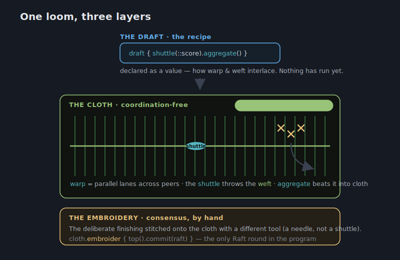
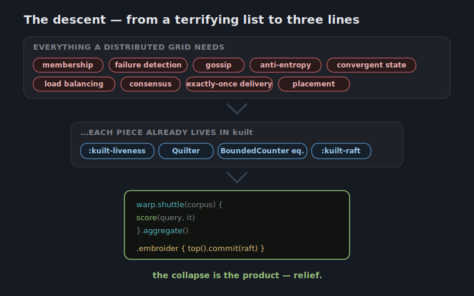

# `:kuilt-warp` — a vision

> **Status: a dream. Highly speculative, unplanned, deliberately aspirational.**
> This is not a spec and not a commitment. It is a picture of the most beautiful
> thing `:kuilt-warp` could be, written so we can decide whether any of it is
> worth a throwaway spike (#680). Part of the research epic #665. Nothing here
> implies code will be written; if it ever is, only a small experiment.

## The one idea

What if running your code across a roomful of machines felt exactly like
running it on one?

You already know how to do a parallel map on a single computer: take a big list,
run a function over every item at once, and fold the answers together. `warp` is
a dream in which *that same line of code* runs across a whole cluster of peers —
phones, laptops, servers, whatever is in the room — and you can't tell the
difference. No servers to stand up, no job scheduler to configure, no message
queue, no coordinator. You write what looks like a local parallel map; a
mesh of devices runs it.

```kotlin
val warp   = warp(seam)                                  // the cluster, from one connection
val scores = warp.shuttle(corpus) { doc -> score(query, doc) }  // runs across every peer
                 .aggregate()                            // answers weave together as they arrive
```

That's the whole pitch. Everything below is the story of why those three lines
are *all you should ever have to write* — and the one place where the
mathematics says you have to write a little more.

## Why this isn't a fantasy: it's mostly already built

The reason this dream is even worth dreaming is that a compute grid needs four
things, and kuilt already ships all four. The vision is not "build a grid." It is
**"notice we already have one, and give it a face."**

| A compute grid needs… | …and kuilt already has |
|---|---|
| to know who's in the room, and who left | `:kuilt-liveness` (membership + failure detection) |
| to spread work and answers around | gossip dissemination (#652) |
| shared state that always agrees in the end | the CRDT zoo + `Quilter` |
| to balance load without a boss | the `BoundedCounter` equalizer (#643/#644/#667) |
| to agree *exactly* when agreement is unavoidable | `:kuilt-raft` |

The fourth row is the quiet punchline. The `BoundedCounter` equalizer we built to
keep quotas balanced is, mathematically, a **decentralized work-stealing
scheduler** — diffusive load balancing and power-of-two-choices, the exact
algorithms a grid uses to place tasks. We built a scheduler in disguise. `warp`
just points it at queue-depth instead of quota.

So `:kuilt-warp` is a *thin reframing*, not a new engine:

```kotlin
class Warp(seam: Seam)                       // the grid — N parallel lanes across the peers
class Weft<R>(/* in-flight results */)       // weft shuttled across the warp; aggregate() weaves the cloth
// queue  = ORSet<Task>          (already have)
// place  = the equalizer         (already have, aimed at depth)
// results = ORMap<Id, R>         (already have)
// move   = Quilter anti-entropy  (already have)
```

The textile metaphor finishes itself — and it stretches across the whole design.
A loom holds the **warp**: the parallel threads under tension. You load a
**shuttle** with the **weft** and throw it across, and the two weave into
**cloth**. Mapped onto the grid:

- **warp** — the parallel compute lanes spread across the peers (`warp(seam)`).
- **weft / shuttle** — `warp.shuttle(...)` throws each task across the warp;
  `.aggregate()` beats the returning threads into **cloth**, the woven,
  coordination-free result.
- **draft** — the *recipe*: how warp and weft interlace, declarable as a value
  before anything runs. (The natural word, *pattern*, is already a core type —
  `weave(Rendezvous.New(pattern))` — so the recipe takes the weaver's other word,
  **draft**.)
- **embroidery** — the deliberate finishing stitched onto the cloth *by hand*,
  where consensus is unavoidable (its own section below). (We pointedly avoid
  calling it a *seam*: `Seam` is already the core contract type.)



## How the method actually travels

A fair question kills most compute-grid dreams: *how does `score` even get to the
other peers and run there?* The honest answer shapes everything, so the doc states
it plainly instead of hand-waving "runs on whoever has capacity."

**You never ship the function. You ship a name and its arguments.** kuilt moves
opaque bytes between peers that might be a JVM server, an iPhone (Kotlin/Native),
and a browser (wasmJs). A Kotlin lambda compiled to JVM bytecode cannot execute on
Native or wasm — there is no portable, runtime-shippable representation of Kotlin
code across those targets. So what crosses the fabric is a tiny **task
descriptor** — `{ op: "score", arg: query, item: docId }` — dropped into the
CRDT work-queue. A peer claims it, looks `"score"` up in a **local operation
registry** that every node populated at startup from the same compiled binary, and
runs *its own copy* on local data. The result merges back as a CRDT. The function
never moved; only its name did.


That implies one honest constraint, stated up front: **a homogeneous binary with
symbolic dispatch.** Every peer runs the same build; the grid distributes
*decisions about where data is processed*, not the processing code. The
`shuttle { … }` block is therefore sugar for "reference a registered operation" —
a compiler plugin (KSP) could auto-register the ops it sees so it still *reads*
like an ordinary lambda.

### The fantasy: shipping real code anyway

Named ops can only run code already in the deployed binary. If we ever wanted to
ship *new* computations at runtime — true code mobility — there is exactly one
substrate that works across kuilt's targets, and the surprise is that it isn't
native code:

- **① Named ops — the default.** Ship `(opId, args)`; the code is already
  everywhere. Works on every target. Limit: no new code at runtime.
- **③ WASM kernels — the fantasy.** Ship a compiled `.wasm` blob *as* the method.
  It's the same bytes on every platform; it's a capability **sandbox** (decisive —
  you'd be running code other peers sent you); and the browser runs it natively.
  Under the hood the desktop/server runtimes (wasmtime/wasmer) JIT it to native via
  Cranelift/LLVM, so near-native speed comes for free. The one hard constraint:
  **iOS forbids runtime JIT**, so on iPhone you *interpret* the wasm (wasm3) —
  slower, but real and portable.
- **Not LLVM IR on the wire.** The tempting "ship LLVM bitcode for native speed"
  path is a trap: bitcode isn't portable (Google tried it — PNaCl — and retired it
  in favour of WebAssembly), it needs the JIT iOS bans, and it's unsandboxed. LLVM
  keeps its rightful job — *inside* the wasm runtime, the thing that makes wasm
  fast — not as a distribution format.

The lovely inversion: the part that *sounds* like science fiction (live code
crossing a phone, a server, and a browser at once) rides on the most ordinary
substrate we already half-target — while the path that *sounds* like the
performance win (native/LLVM) is the dead end. Code mobility is a tier, not a
switch: names by default, sandboxed wasm kernels when you genuinely must ship code,
never raw native.


## The reduction to simplicity

This is the heart of the vision, and the part the documentation must *dramatize*.

A distributed compute grid is, on paper, terrifying: membership protocols,
failure detectors, gossip, anti-entropy, convergent replicated state, load
balancing, consensus, exactly-once delivery. A reader's shoulders go up just
reading the list.

The dream is to watch that entire list **collapse**. Each item is real, but each
one is already solved inside kuilt and already invisible — so the surface that
remains is:

```kotlin
warp.shuttle(corpus) { score(query, it) }.aggregate()
```

That collapse *is* the product. The documentation should walk the reader down the
mountain: here is everything a grid needs (the scary list) → here is where each
piece already lives (the table) → here is what's left for you to type (three
lines). The feeling we are selling is **relief**: "oh — I don't have to think
about any of that."



## Embroidery: the one place you stitch by hand

There is exactly one place the simplicity is *allowed* to leak, and it leaks for a
deep reason, not a missing feature. The woven cloth is cheap and mechanical; the
**embroidery** is the deliberate finishing you work onto it by hand, with a
different tool, where the value concentrates.

Some questions can be answered with no coordination at all: *how many?*, *what's
the running total?*, *merge everyone's partial rankings*. These only ever grow —
add more data, the answer only gets more complete — so every peer can compute them
independently and they always converge. The **CALM theorem** is the precise
statement of this: computations expressible in monotone logic have
coordination-free distributed implementations, and *only* those do.

The other kind of question forces agreement: *who is the single winner?*,
*assign this task to exactly one peer*, *commit — final answer, no take-backs*.
A late arrival can change a winner, so the peers must stop and agree. CALM says
this isn't pessimism or a weak implementation — it is a hard boundary. Crossing it
costs a round of consensus, every time, for everyone.

The beautiful move is to make that boundary the cloth's **embroidery** — the one
part worked by hand, on top, where the type itself flips from woven to stitched:

```kotlin
val ranked : CoordinationFree<Ranking<DocId>> =          // woven cloth — zero coordination
    warp.shuttle(corpus) { score(query, it) }.aggregate()

val winner : Coordinated<DocId> = ranked.top()           // argmax is non-monotone → type flips
val chosen : DocId              = winner.commit(raft)     // the ONLY consensus — the hand-stitch
```

`commit` is the needle going in: `embroider { top().commit(raft) }` reads as one
deliberate stitch, and it is the only place a Raft round is ever spent.

Two properties make this lovely rather than burdensome:

1. **You never write a proof.** `shuttle` and `aggregate` are coordination-free *by
   construction* — they are the library's vetted monotone combinators. The CALM
   theory isn't on your screen; it retreated into the combinators where it can't be
   gotten wrong. (Earlier in the dream we imagined forcing the user to *prove*
   monotonicity in the type system — provably correct, and unusable. The right
   place for the theorem is inside the library, not on the caller's keyboard.)
2. **You can't spend consensus by accident.** The only way to get a single agreed
   answer is through `Coordinated`, and `.commit(raft)` is the only door out of it.
   The cost is grep-able, reviewable, and impossible to hide. The compiler quietly
   enforces the one rule that matters: *don't coordinate unless the question
   actually requires it.*

So the surface tells the truth: everything cheap looks local; the one expensive
thing looks like exactly one expensive line.

## What is real, and what is a dream

- **Real, and the only thing we might build:** the spike in #680 — wire the
  existing pieces into a minimal `Warp`, run one `shuttle`/`aggregate` over the
  simulation harness, and write down where the CALM boundary actually bites.
  Throwaway by default. Never wired into the default target set or the public API
  without a separate, deliberate decision.
- **A dream:** everything else on this page — the polished
  `warp`/`weft`/`shuttle`/`draft`/`embroidery` surface, the
  `CoordinationFree`/`Coordinated` types, the wasm-kernel code mobility, the
  three-act documentation. It exists to give the spike a north star and to be
  enjoyed, not to be scheduled.

The hero example here is search-and-rank because it contains both halves (a
monotone aggregate and a non-monotone winner); any embarrassingly-parallel +
reduce + decide workload tells the same story and is freely swappable.

## The precedent

If we ever did build it, we would be walking a path **Lasp** (Meiklejohn & Van
Roy, PPDP 2015) already mapped: CRDTs as the computational substrate, monotone
programs proven equivalent to a single centralized execution, no consensus on the
happy path. `:kuilt-warp` would be Lasp's idea wearing kuilt's clothes — and
standing on machinery kuilt already had all along.
